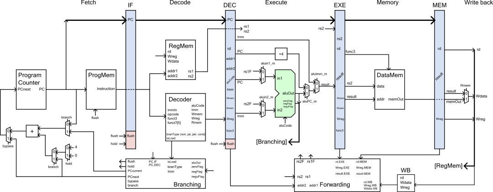

# RiscV labs for education

This repository includes the design for a single stage and pipelined RiscV processor 
compatable with RV32I instructions.

## Pipelined 

### Feature list

- Forwarding
- Dynamic branch prediction

### Verification
